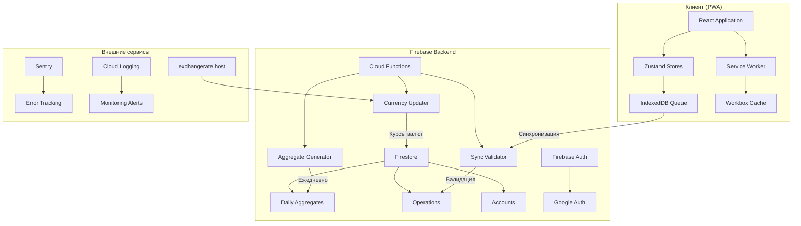
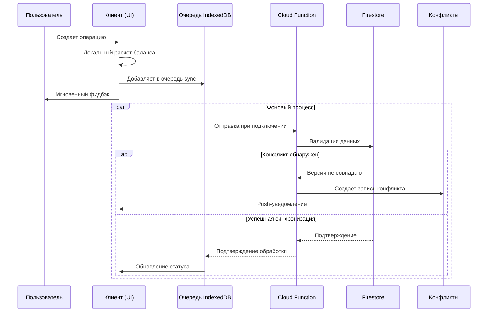

# Архитектурная Документация FinPal

## 1. Обзор Архитектуры

**FinPal** — прогрессивное веб-приложение (PWA) для управления личными финансами с оффлайн-первым подходом. Архитектура построена на принципах надежности, производительности и поддерживаемости.

### Ключевые характеристики:
- **offline-first дизайн**: Полная функциональность без подключения к сети
- **Гибридный баланс**: Локальный расчет + серверная валидация
- **Ручное разрешение конфликтов**: Пользовательский контроль над синхронизацией
- **Предварительная агрегация**: Оптимизация отчетов через ежедневные сводки
- **Feature-based структура**: Четкое разделение доменов

## 2. Технологический Стек

| Компонент | Технология | Обоснование |
|-----------|------------|-------------|
| **Frontend** | React 19 + TypeScript | Типобезопасность, современные фичи |
| **State Management** | Zustand | Простота, производительность |
| **UI Framework** | Material-UI | Консистентность, доступность |
| **Роутинг** | React Router | Навигация, protected routes |
| **Оффлайн-хранилище** |  Firebase persistence + IndexedDB | Надежное локальное хранение |
| **Backend** | Firebase (Firestore, Functions, Auth) | Бессерверная архитектура, real-time |
| **Валидация** | Zod | End-to-end валидация и типобезопасность |
| **Визуализация** | Recharts | Легковесные, кастомизируемые графики |
| **CI/CD** | GitHub Actions | Автоматизация сборки и деплоя |
| **Мониторинг** | Sentry + Cloud Logging | Отслеживание ошибок и производительности |

## 3. Доменная Модель

### 3.1 Основные сущности

```typescript
// Ядро доменной модели
interface Operation {
  id: string;
  userId: string;
  type: 'income' | 'expense' | 'transfer';
  amount: number;
  currency: string;
  accountId: string;
  targetAccountId?: string; // Для transfer
  categoryId: string;
  date: Date;
  description: string;
  tagIds: string[];
  status: 'pending' | 'completed' | 'cancelled';
  version: number; // Для optimistic concurrency
  clientVersion: number; // Версия с клиента
  createdAt: Date;
  updatedAt: Date;
}

interface Account {
  id: string;
  userId: string;
  name: string;
  currency: string;
  balance: number; // Оптимистичный баланс
  balanceValidated: number; // Серверный баланс
  balanceValidationHash: string; // Хеш для проверки
  color: string;
  isArchived: boolean;
  lastValidation?: Date;
  requiresCheck: boolean; // Флаг ручной проверки
}

interface Category {
  id: string;
  userId: string;
  name: string;
  type: 'income' | 'expense' | 'transfer';
  parentId?: string;
  path: string; // Для иерархических запросов
  color: string;
  isArchived: boolean;
}

interface DailyAggregate {
  id: string; // Формат: {userId}_{YYYY-MM-DD}
  userId: string;
  date: string; // YYYY-MM-DD
  totalIncome: number;
  totalExpense: number;
  byCategory: Record<string, CategorySummary>;
  byAccount: Record<string, AccountSummary>;
  operationCount: number;
  generatedAt: Date;
}
```

### 3.2 Правила бизнес-логики

1. **Минимальная валидация операций**:
   - Обязательные поля: сумма (> 0), дата
   - Будущие даты разрешены
   - Отрицательный баланс разрешен
   - Архивация счета не влияет на существующие операции

2. **Архивация вместо удаления**:
   - Все сущности (счета, категории, теги) поддерживают флаг `isArchived`
   - Удаление физически не предусмотрено
   - Архивированные сущности скрыты в UI по умолчанию

## 4. Системная Архитектура

### 4.1 Высокоуровневая схема



### 4.2 Поток синхронизации операций



## 5. Модульная структура проекта

**Roadmap:** M0 (определение структуры), M1 (базовые модули), M2 (расширение модулей)

```
finpal/
├── src/
│   ├── features/                    # Доменные модули
│   │   ├── accounts/               # Модуль счетов
│   │   │   ├── components/         # AccountList, AccountForm
│   │   │   │   ├── AccountCard.tsx
│   │   │   │   ├── AccountForm.tsx
│   │   │   │   └── BalanceDisplay.tsx
│   │   │   ├── hooks/              # Кастомные хуки
│   │   │   │   ├── useAccounts.ts
│   │   │   │   ├── useAccountBalance.ts
│   │   │   │   └── useAccountOperations.ts
│   │   │   ├── stores/             # Zustand сторы
│   │   │   │   └── accountStore.ts
│   │   │   ├── types/              # Типы и интерфейсы
│   │   │   │   ├── account.types.ts
│   │   │   │   └── account.dto.ts
│   │   │   ├── utils/              # Вспомогательные функции
│   │   │   │   └── balanceCalculator.ts
│   │   │   └── index.ts            # Public API модуля
│   │   │
│   │   ├── operations/             # Модуль операций (аналогично)
│   │   ├── categories/             # Модуль категорий
│   │   ├── tags/                   # Модуль тегов
│   │   ├── sync/                   # Синхронизация и конфликты
│   │   ├── reports/                # Отчеты и аналитика
│   │   └── currency/               # Валюты и конвертация
│   │
│   ├── shared/                     # Общие ресурсы
│   │   ├── ui/                     # Переиспользуемые UI компоненты
│   │   │   ├── buttons/
│   │   │   ├── inputs/
│   │   │   ├── dialogs/
│   │   │   └── indicators/
│   │   ├── hooks/                  # Глобальные хуки
│   │   │   ├── useOfflineStatus.ts
│   │   │   ├── useFirebaseQuery.ts
│   │   │   └── useDebounce.ts
│   │   ├── utils/                  # Утилиты
│   │   │   ├── formatters.ts       # Форматирование чисел, дат
│   │   │   ├── validators.ts       # Валидация данных
│   │   │   └── calculations.ts     # Математические операции
│   │   ├── services/               # Сервисы
│   │   │   ├── firebase/
│   │   │   │   ├── config.ts
│   │   │   │   ├── db.ts
│   │   │   │   └── auth.ts
│   │   │   └── api/
│   │   │       └── currencyApi.ts
│   │   └── constants/              # Константы
│   │       ├── routes.ts
│   │       ├── currencies.ts
│   │       └── validation.ts
│   │
│   ├── app/                        # Конфигурация приложения
│   │   ├── routing/
│   │   │   ├── AppRouter.tsx
│   │   │   ├── ProtectedRoute.tsx
│   │   │   └── routes.config.ts
│   │   ├── providers/              # Провайдеры контекста
│   │   │   ├── AppProviders.tsx
│   │   │   ├── StoreProvider.tsx
│   │   │   └── ThemeProvider.tsx
│   │   ├── layouts/                # Макеты страниц
│   │   │   ├── MainLayout.tsx
│   │   │   ├── AuthLayout.tsx
│   │   │   └── DashboardLayout.tsx
│   │   └── config/                 # Конфигурация
│   │       ├── env.ts
│   │       └── pwa.config.ts
│   │
│   └── index.tsx                   # Точка входа
│
├── firebase-functions/             # Cloud Functions
│   ├── src/
│   │   ├── sync/                   # Синхронизация
│   │   │   ├── syncOperation.ts
│   │   │   ├── conflictResolver.ts
│   │   │   └── index.ts
│   │   ├── aggregates/             # Агрегация данных
│   │   │   ├── generateDailyAggregate.ts
│   │   │   ├── updateMonthlyAggregate.ts
│   │   │   └── index.ts
│   │   ├── currency/               # Обновление валют
│   │   │   ├── updateCurrencyRates.ts
│   │   │   ├── currencyFallback.ts
│   │   │   └── index.ts
│   │   ├── templates/              # Шаблоны и регулярные операции
│   │   │   └── generateRecurringOperations.ts
│   │   └── shared/                 # Общие утилиты функций
│   │       ├── logger.ts
│   │       ├── firebaseAdmin.ts
│   │       └── types.ts
│   ├── package.json
│   └── tsconfig.json
│
├── public/                         # Статические файлы
│   ├── manifest.json              # PWA манифест
│   ├── service-worker.js          // Service Worker
│   └── icons/                     # Иконки для PWA
│
├── tests/                          # Тесты
│   ├── unit/                      # Юнит-тесты
│   ├── e2e/                       # E2E тесты (PlayWright)
│   └── fixtures/                  # Тестовые данные
│
└── package.json
```

## 6. State Management с Zustand

**Roadmap:** M1 (базовые сторы), M2 (доменные сторы), M3 (расширенные сторы)

### 6.1 Доменные сторы

```typescript
// features/accounts/stores/accountStore.ts
import { create } from 'zustand';
import { persist } from 'zustand/middleware';

interface AccountState {
  // Состояние
  accounts: Account[];
  isLoading: boolean;
  error: string | null;
  
  // Геттеры (computed values)
  activeAccounts: () => Account[];
  archivedAccounts: () => Account[];
  getAccountById: (id: string) => Account | undefined;
  getAccountBalance: (accountId: string) => number;
  
  // Действия
  fetchAccounts: () => Promise<void>;
  createAccount: (data: AccountCreateDto) => Promise<Account>;
  updateAccount: (id: string, data: Partial<Account>) => Promise<void>;
  archiveAccount: (id: string) => Promise<void>;
  
  // Локальные вычисления (оффлайн)
  recalcLocalBalance: (accountId: string, operation: Operation) => void;
  validateBalance: (accountId: string) => Promise<ValidationResult>;
}

export const useAccountStore = create<AccountState>()(
  persist(
    (set, get) => ({
      accounts: [],
      isLoading: false,
      error: null,
      
      activeAccounts: () => get().accounts.filter(a => !a.isArchived),
      
      getAccountBalance: (accountId: string) => {
        const account = get().accounts.find(a => a.id === accountId);
        return account?.balance || 0;
      },
      
      recalcLocalBalance: (accountId: string, operation: Operation) => {
        const accounts = [...get().accounts];
        const accountIndex = accounts.findIndex(a => a.id === accountId);
        
        if (accountIndex !== -1) {
          const account = accounts[accountIndex];
          
          // Логика пересчета баланса
          let newBalance = account.balance;
          if (operation.type === 'income') {
            newBalance += operation.amount;
          } else if (operation.type === 'expense') {
            newBalance -= operation.amount;
          }
          // Для transfer логика сложнее...
          
          accounts[accountIndex] = {
            ...account,
            balance: newBalance,
            requiresCheck: true // Помечаем для валидации
          };
          
          set({ accounts });
        }
      },
      
      // ... остальные действия
    }),
    {
      name: 'account-storage',
      getStorage: () => localStorage, // или IndexedDB через idb-keyval
    }
  )
);
```

### 6.2 Стор синхронизации

```typescript
// features/sync/stores/syncStore.ts
interface SyncQueueItem {
  id: string;
  type: 'operation' | 'account' | 'category';
  action: 'create' | 'update' | 'archive';
  data: any;
  timestamp: number;
  retryCount: number;
  status: 'pending' | 'processing' | 'failed' | 'conflict';
}

interface Conflict {
  id: string;
  entityType: string;
  entityId: string;
  originalData: any;    // Серверная версия
  clientData: any;      // Клиентская версия
  conflictType: 'balance' | 'category' | 'duplicate';
  createdAt: Date;
  resolved: boolean;
}

interface SyncState {
  queue: SyncQueueItem[];
  conflicts: Conflict[];
  isOnline: boolean;
  isSyncing: boolean;
  lastSync: Date | null;
  
  addToQueue: (item: Omit<SyncQueueItem, 'id' | 'timestamp' | 'status'>) => void;
  processQueue: () => Promise<void>;
  resolveConflict: (conflictId: string, choice: 'client' | 'server' | 'manual') => Promise<void>;
  retryFailed: () => Promise<void>;
  clearResolvedConflicts: () => void;
}
```

## 7. Firestore Database Design

### 7.1 Схема коллекций

```
/users/{userId}/
  ├── metadata (документ)
  │   ├── createdAt
  │   ├── lastActive
  │   └── settings
  │
  ├── accounts/{accountId}
  │   ├── name
  │   ├── currency
  │   ├── balance
  │   ├── balanceValidated
  │   ├── balanceValidationHash
  │   ├── color
  │   ├── isArchived
  │   └── requiresCheck
  │
  ├── categories/{categoryId}
  │   ├── name
  │   ├── type
  │   ├── parentId
  │   ├── path
  │   ├── color
  │   └── isArchived
  │
  ├── operations/{operationId}
  │   ├── type
  │   ├── amount
  │   ├── currency
  │   ├── accountId
  │   ├── categoryId
  │   ├── date
  │   ├── status
  │   ├── version
  │   ├── clientVersion
  │   └── syncStatus
  │
  ├── aggregates/{date}  // YYYY-MM-DD
  │   ├── totalIncome
  │   ├── totalExpense
  │   ├── byCategory
  │   ├── byAccount
  │   └── generatedAt
  │
  ├── conflicts/{conflictId}
  │   ├── entityType
  │   ├── entityId
  │   ├── originalData
  │   ├── clientData
  │   ├── conflictType
  │   └── resolved
  │
  └── templates/{templateId}
      ├── name
      ├── type
      ├── amount
      ├── isRecurring
      ├── recurrence
      └── nextOccurrence
```

### 7.2 Индексы (композитные)

```javascript
// firestore.indexes.json
{
  "indexes": [
    {
      "collectionGroup": "operations",
      "queryScope": "COLLECTION",
      "fields": [
        { "fieldPath": "userId", "order": "ASCENDING" },
        { "fieldPath": "date", "order": "DESCENDING" },
        { "fieldPath": "accountId", "order": "ASCENDING" }
      ]
    },
    {
      "collectionGroup": "operations",
      "queryScope": "COLLECTION",
      "fields": [
        { "fieldPath": "userId", "order": "ASCENDING" },
        { "fieldPath": "categoryId", "order": "ASCENDING" },
        { "fieldPath": "date", "order": "DESCENDING" }
      ]
    },
    {
      "collectionGroup": "aggregates",
      "queryScope": "COLLECTION",
      "fields": [
        { "fieldPath": "userId", "order": "ASCENDING" },
        { "fieldPath": "date", "order": "DESCENDING" }
      ]
    }
  ]
}
```

### 7.3 Security Rules

**Roadmap:** M0 (базовые правила), M2 (расширенные правила для операций)

```javascript
rules_version = '2';
service cloud.firestore {
  match /databases/{database}/documents {
    // Вспомогательные функции
    function isAuthenticated() {
      return request.auth != null;
    }
    
    function isOwner(userId) {
      return request.auth.uid == userId;
    }
    
    function isValidOperation() {
      return request.resource.data.amount > 0 &&
             request.resource.data.date is timestamp;
    }
    
    // Основные правила
    match /users/{userId} {
      allow read, write: if isAuthenticated() && isOwner(userId);
      
      match /accounts/{accountId} {
        allow read: if isAuthenticated() && isOwner(userId);
        allow create: if isAuthenticated() && isOwner(userId) &&
                      request.resource.data.userId == userId;
        allow update: if isAuthenticated() && isOwner(userId) &&
                      resource.data.userId == userId &&
                      // Разрешаем только определенные поля
                      request.resource.data.keys().hasOnly([
                        'name', 'color', 'description', 'isArchived',
                        'balance', 'balanceValidationHash', 'requiresCheck'
                      ]);
      }
      
      match /operations/{operationId} {
        allow read: if isAuthenticated() && isOwner(userId);
        allow create: if isAuthenticated() && isOwner(userId) &&
                      isValidOperation() &&
                      request.resource.data.userId == userId;
        allow update: if isAuthenticated() && isOwner(userId) &&
                      resource.data.userId == userId &&
                      // Только несистемные поля
                      request.resource.data.keys().hasOnly([
                        'description', 'categoryId', 'tagIds',
                        'status', 'version'
                      ]);
      }
      
      match /aggregates/{date} {
        allow read: if isAuthenticated() && isOwner(userId);
        allow write: if false; // Только Cloud Functions
      }
      
      match /conflicts/{conflictId} {
        allow read: if isAuthenticated() && isOwner(userId);
        allow write: if isAuthenticated() && isOwner(userId);
      }
    }
  }
}
```

### 7.4 Безопасность на уровне Cloud Functions

**Roadmap:** M2 (базовая валидация), M3 (расширенная безопасность)

#### 7.4.1 Валидация входных данных

Все Cloud Functions должны валидировать входные данные с помощью Zod перед обработкой:

```typescript
// firebase-functions/src/shared/security/inputValidator.ts
import { z } from 'zod';
import { logger } from '../logger';

/**
 * Валидирует входные данные Cloud Function с помощью Zod схемы.
 * Логирует попытки невалидных запросов для аудита безопасности.
 * @param data - Входные данные для валидации
 * @param schema - Zod схема для валидации
 * @param context - Контекст функции (для логирования)
 * @returns Валидированные данные
 * @throws {ValidationError} Если данные не прошли валидацию
 */
export const validateInput = <T extends z.ZodTypeAny>(
  data: unknown,
  schema: T,
  context?: { functionName: string; userId?: string }
): z.infer<T> => {
  const result = schema.safeParse(data);
  
  if (!result.success) {
    // Логируем попытку невалидного запроса
    logger.warn('Invalid input detected', {
      functionName: context?.functionName,
      userId: context?.userId,
      errors: result.error.errors,
      input: sanitizeForLogging(data), // Удаляем чувствительные данные
    });
    
    throw new ValidationError('Invalid input data', result.error);
  }
  
  return result.data;
};

/**
 * Очищает данные от чувствительной информации перед логированием.
 */
const sanitizeForLogging = (data: unknown): unknown => {
  if (typeof data !== 'object' || data === null) {
    return data;
  }
  
  const sanitized = { ...data };
  const sensitiveFields = ['password', 'token', 'secret', 'apiKey'];
  
  for (const field of sensitiveFields) {
    if (field in sanitized) {
      sanitized[field] = '[REDACTED]';
    }
  }
  
  return sanitized;
};
```

#### 7.4.2 Защита от CSRF

```typescript
// firebase-functions/src/shared/security/csrfProtection.ts
import { Request, Response } from 'express';

/**
 * Проверяет CSRF токен для HTTP Cloud Functions.
 * Для Firestore triggers CSRF не требуется (внутренние вызовы).
 */
export const validateCSRFToken = (req: Request, res: Response, next: Function) => {
  const token = req.headers['x-csrf-token'];
  const sessionToken = req.cookies?.csrfToken;
  
  if (!token || token !== sessionToken) {
    logger.warn('CSRF token validation failed', {
      ip: req.ip,
      userAgent: req.headers['user-agent'],
    });
    
    return res.status(403).json({
      error: 'Invalid CSRF token',
      code: 'CSRF_TOKEN_INVALID',
    });
  }
  
  next();
};
```

#### 7.4.3 Защита от XSS

```typescript
// shared/utils/sanitization.ts
import DOMPurify from 'dompurify';

/**
 * Очищает пользовательский ввод от потенциально опасного HTML/JavaScript.
 * Используется перед отображением данных в UI.
 * @param input - Пользовательский ввод
 * @returns Очищенная строка
 */
export const sanitizeInput = (input: string): string => {
  return DOMPurify.sanitize(input, {
    ALLOWED_TAGS: [], // Запрещаем все HTML теги
    ALLOWED_ATTR: [],
  });
};

/**
 * Экранирует специальные символы для безопасного использования в HTML.
 */
export const escapeHtml = (text: string): string => {
  const map: Record<string, string> = {
    '&': '&amp;',
    '<': '&lt;',
    '>': '&gt;',
    '"': '&quot;',
    "'": '&#039;',
  };
  
  return text.replace(/[&<>"']/g, (m) => map[m]);
};
```

#### 7.4.4 Управление секретами

```typescript
// firebase-functions/src/shared/config/secrets.ts
import * as functions from 'firebase-functions';

/**
 * Получает секрет из Firebase Functions Config.
 * Секреты настраиваются через Firebase CLI:
 * firebase functions:secrets:set SECRET_NAME
 * @param secretName - Имя секрета
 * @returns Значение секрета
 * @throws {Error} Если секрет не найден
 */
export const getSecret = (secretName: string): string => {
  const secret = functions.config().secrets?.[secretName];
  
  if (!secret) {
    throw new Error(`Secret ${secretName} not found`);
  }
  
  return secret;
};

// Использование
const apiKey = getSecret('EXCHANGE_RATE_API_KEY');
```

```typescript
// app/config/env.ts (клиентская сторона)
/**
 * Безопасное управление переменными окружения на клиенте.
 * Критические секреты НЕ должны быть доступны на клиенте.
 */
export const getFirebaseConfig = (): FirebaseConfig => {
  // API ключи Firebase безопасны для публикации на клиенте
  // Они защищены через Security Rules и доменные ограничения
  return {
    apiKey: import.meta.env.VITE_FIREBASE_API_KEY,
    authDomain: import.meta.env.VITE_FIREBASE_AUTH_DOMAIN,
    projectId: import.meta.env.VITE_FIREBASE_PROJECT_ID,
    // ... остальные публичные конфиги
  };
};

// НИКОГДА не храните на клиенте:
// - API ключи внешних сервисов
// - Секретные ключи
// - Приватные токены
```

#### 7.4.5 Аудит-логирование критических операций

```typescript
// firebase-functions/src/shared/security/auditLogger.ts
import { logger } from '../logger';

interface AuditEvent {
  userId: string;
  action: string;
  resource: string;
  resourceId?: string;
  metadata?: Record<string, unknown>;
  timestamp: Date;
  ipAddress?: string;
  userAgent?: string;
}

/**
 * Логирует критическое действие для аудита безопасности.
 * Сохраняет в Firestore для долгосрочного хранения.
 */
export const logAuditEvent = async (event: AuditEvent): Promise<void> => {
  // Структурированное логирование в Cloud Logging
  logger.info('Audit event', {
    severity: 'AUDIT',
    userId: event.userId,
    action: event.action,
    resource: event.resource,
    resourceId: event.resourceId,
    metadata: event.metadata,
    timestamp: event.timestamp.toISOString(),
    ipAddress: event.ipAddress,
    userAgent: event.userAgent,
  });
  
  // Сохранение в Firestore для долгосрочного аудита
  await admin.firestore()
    .collection('audit_logs')
    .add({
      ...event,
      timestamp: admin.firestore.FieldValue.serverTimestamp(),
    });
};

// Использование в Cloud Functions
export const syncOperation = functions.firestore
  .document('users/{userId}/operations/{operationId}')
  .onWrite(async (change, context) => {
    const { userId, operationId } = context.params;
    
    // Аудит создания операции
    if (change.after.exists && !change.before.exists) {
      await logAuditEvent({
        userId,
        action: 'operation.created',
        resource: 'operation',
        resourceId: operationId,
        metadata: {
          type: change.after.data()?.type,
          amount: change.after.data()?.amount,
        },
        timestamp: new Date(),
      });
    }
    
    // ... остальная логика
  });
```

#### 7.4.6 Rate Limiting

```typescript
// firebase-functions/src/shared/security/rateLimiter.ts
import { logger } from '../logger';

interface RateLimitConfig {
  maxRequests: number;
  windowMs: number; // Окно времени в миллисекундах
}

/**
 * Простой in-memory rate limiter для Cloud Functions.
 * Для production рекомендуется использовать Redis или Firebase Extensions.
 */
class RateLimiter {
  private requests: Map<string, number[]> = new Map();
  
  /**
   * Проверяет, не превышен ли лимит запросов.
   * @param identifier - Уникальный идентификатор (userId, IP и т.д.)
   * @param config - Конфигурация лимита
   * @returns true, если запрос разрешен, false если лимит превышен
   */
  checkLimit(identifier: string, config: RateLimitConfig): boolean {
    const now = Date.now();
    const userRequests = this.requests.get(identifier) || [];
    
    // Удаляем старые запросы вне окна
    const recentRequests = userRequests.filter(
      (timestamp) => now - timestamp < config.windowMs
    );
    
    if (recentRequests.length >= config.maxRequests) {
      logger.warn('Rate limit exceeded', {
        identifier,
        requests: recentRequests.length,
        maxRequests: config.maxRequests,
      });
      return false;
    }
    
    // Добавляем текущий запрос
    recentRequests.push(now);
    this.requests.set(identifier, recentRequests);
    
    return true;
  }
  
  /**
   * Очищает старые записи для экономии памяти.
   */
  cleanup(): void {
    const now = Date.now();
    for (const [identifier, requests] of this.requests.entries()) {
      const recentRequests = requests.filter(
        (timestamp) => now - timestamp < 60000 // 1 минута
      );
      
      if (recentRequests.length === 0) {
        this.requests.delete(identifier);
      } else {
        this.requests.set(identifier, recentRequests);
      }
    }
  }
}

const rateLimiter = new RateLimiter();

// Периодическая очистка
setInterval(() => rateLimiter.cleanup(), 60000);

/**
 * Middleware для rate limiting в HTTP Cloud Functions.
 */
export const rateLimitMiddleware = (config: RateLimitConfig) => {
  return (req: Request, res: Response, next: Function) => {
    const identifier = req.auth?.uid || req.ip;
    
    if (!rateLimiter.checkLimit(identifier, config)) {
      return res.status(429).json({
        error: 'Too many requests',
        code: 'RATE_LIMIT_EXCEEDED',
        retryAfter: Math.ceil(config.windowMs / 1000),
      });
    }
    
    next();
  };
};

// Использование
export const createOperation = functions.https.onRequest(
  rateLimitMiddleware({ maxRequests: 10, windowMs: 60000 }), // 10 запросов в минуту
  async (req, res) => {
    // ... логика создания операции
  }
);
```

### 7.5 Рекомендации по безопасности

1. **Всегда валидируйте на сервере**: Security Rules + Cloud Functions валидация
2. **Используйте Zod схемы**: Единый источник истины для валидации
3. **Логируйте подозрительную активность**: Аудит критических операций
4. **Ограничивайте доступ**: Принцип наименьших привилегий
5. **Защищайте секреты**: Используйте Firebase Secrets, не храните в коде
6. **Регулярно обновляйте зависимости**: Проверяйте уязвимости через `npm audit`
7. **Мониторьте аномалии**: Настройте алерты на подозрительную активность

## 8. Cloud Functions

**Roadmap:** M3 (валюты, регулярные операции), M4 (агрегация данных), M5 (бэкапы)

### 8.1 Генерация ежедневных агрегатов

```typescript
// firebase-functions/src/aggregates/generateDailyAggregate.ts
export const generateDailyAggregate = functions.pubsub
  .schedule('0 3 * * *') // Каждый день в 03:00
  .timeZone('Europe/Moscow')
  .onRun(async (context) => {
    const logger = createLogger('generateDailyAggregate');
    
    try {
      // 1. Определяем дату для агрегации (вчера)
      const yesterday = new Date();
      yesterday.setDate(yesterday.getDate() - 1);
      const dateKey = formatDate(yesterday); // "2024-01-15"
      
      // 2. Получаем всех активных пользователей
      const users = await getActiveUsers();
      logger.info(`Processing ${users.length} users for ${dateKey}`);
      
      // 3. Обрабатываем каждого пользователя
      const promises = users.map(async (user) => {
        try {
          // 4. Получаем операции за день
          const operations = await getOperationsForDate(user.uid, yesterday);
          
          if (operations.length === 0) {
            logger.debug(`No operations for user ${user.uid} on ${dateKey}`);
            return;
          }
          
          // 5. Вычисляем агрегаты
          const aggregate = {
            userId: user.uid,
            date: dateKey,
            totalIncome: calculateTotalIncome(operations),
            totalExpense: calculateTotalExpense(operations),
            byCategory: groupOperationsByCategory(operations),
            byAccount: groupOperationsByAccount(operations),
            operationCount: operations.length,
            generatedAt: new Date(),
            _metadata: {
              processingTime: new Date(),
              operationCount: operations.length
            }
          };
          
          // 6. Сохраняем в Firestore
          await admin.firestore()
            .collection(`users/${user.uid}/aggregates`)
            .doc(dateKey)
            .set(aggregate, { merge: true });
            
          // 7. Обновляем месячный агрегат
          await updateMonthlyAggregate(user.uid, dateKey, aggregate);
          
          logger.debug(`Aggregate created for ${user.uid}: ${dateKey}`);
        } catch (userError) {
          logger.error(`Error processing user ${user.uid}:`, userError);
          // Продолжаем обработку других пользователей
        }
      });
      
      await Promise.allSettled(promises);
      logger.info(`Completed daily aggregation for ${dateKey}`);
      
    } catch (error) {
      logger.error('Failed to generate daily aggregates:', error);
      throw error;
    }
  });

// Вспомогательная функция для месячных агрегатов
async function updateMonthlyAggregate(
  userId: string, 
  dateKey: string, 
  dailyAggregate: DailyAggregate
): Promise<void> {
  const monthKey = dateKey.substring(0, 7); // "2024-01"
  
  const monthlyRef = admin.firestore()
    .collection(`users/${userId}/monthlyAggregates`)
    .doc(monthKey);
  
  await monthlyRef.set({
    userId,
    month: monthKey,
    lastUpdated: new Date(),
    dailyCount: admin.firestore.FieldValue.increment(1),
    totalIncome: admin.firestore.FieldValue.increment(dailyAggregate.totalIncome),
    totalExpense: admin.firestore.FieldValue.increment(dailyAggregate.totalExpense),
    // ... другие поля
  }, { merge: true });
}
```

### 8.2 Синхронизация операций с валидацией

```typescript
// firebase-functions/src/sync/syncOperation.ts
export const syncOperation = functions.firestore
  .document('users/{userId}/operations/{operationId}')
  .onWrite(async (change, context) => {
    const { userId, operationId } = context.params;
    const logger = createLogger('syncOperation');
    
    // Если документ удален - ничего не делаем
    if (!change.after.exists) {
      return;
    }
    
    const operation = change.after.data() as Operation;
    
    // Пропускаем операции, созданные системами
    if (operation.createdBy === 'system' || operation.syncStatus === 'validated') {
      return;
    }
    
    try {
      // 1. Валидация бизнес-правил
      validateOperation(operation);
      
      // 2. Получаем связанный счет
      const accountRef = admin.firestore()
        .doc(`users/${userId}/accounts/${operation.accountId}`);
      const accountSnap = await accountRef.get();
      
      if (!accountSnap.exists) {
        throw new Error(`Account ${operation.accountId} not found`);
      }
      
      const account = accountSnap.data() as Account;
      
      // 3. Проверяем версию конфликта
      const hasConflict = await checkForConflict(
        userId, 
        operationId, 
        operation
      );
      
      if (hasConflict) {
        // Создаем запись конфликта
        await createConflictRecord(userId, {
          entityType: 'operation',
          entityId: operationId,
          originalData: hasConflict.original,
          clientData: operation,
          conflictType: 'version_mismatch',
          createdAt: new Date(),
          resolved: false
        });
        
        logger.warn(`Conflict detected for operation ${operationId}`);
        return;
      }
      
      // 4. Валидация баланса
      const balanceValidation = await validateAccountBalance(
        userId,
        account.id,
        operation
      );
      
      // 5. Обновляем операцию с серверными метаданными
      await change.after.ref.update({
        syncStatus: 'validated',
        validatedAt: new Date(),
        serverVersion: (operation.clientVersion || 0) + 1,
        balanceImpact: balanceValidation.balanceChange,
        _metadata: {
          validatedBy: 'syncOperation',
          validationTimestamp: new Date()
        }
      });
      
      // 6. Обновляем баланс счета если нужно
      if (balanceValidation.requiresBalanceUpdate) {
        await updateAccountBalance(
          userId,
          account.id,
          balanceValidation.newBalance,
          operationId
        );
      }
      
      logger.info(`Operation ${operationId} synced successfully`);
      
    } catch (error) {
      logger.error(`Failed to sync operation ${operationId}:`, error);
      
      // Помечаем операцию как failed
      await change.after.ref.update({
        syncStatus: 'failed',
        syncError: error.message,
        lastRetry: new Date()
      });
      
      // Можно отправить уведомление пользователю
    }
  });
```

### 8.3 Обновление валютных курсов с fallback

```typescript
// firebase-functions/src/currency/updateCurrencyRates.ts
export const updateCurrencyRates = functions.pubsub
  .schedule('0 2 * * *') // 02:00 ежедневно
  .timeZone('UTC')
  .onRun(async (context) => {
    const logger = createLogger('updateCurrencyRates');
    const CACHE_DURATION = 24 * 60 * 60 * 1000; // 24 часа
    
    try {
      logger.info('Starting currency rates update');
      
      // 1. Пытаемся получить свежие курсы
      let rates;
      try {
        rates = await fetchRatesFromExchangerateHost();
        logger.info(`Fetched ${Object.keys(rates).length} rates from API`);
      } catch (apiError) {
        logger.warn('API fetch failed, trying fallback:', apiError);
        rates = await getCachedRatesWithFallback();
      }
      
      // 2. Проверяем актуальность полученных курсов
      if (isStaleRates(rates, CACHE_DURATION)) {
        logger.warn('Rates are stale, using cached version');
        rates = await getLastValidRates();
      }
      
      // 3. Сохраняем курсы в Firestore
      const batch = admin.firestore().batch();
      const baseCurrency = 'USD';
      const updateTime = new Date();
      
      for (const [currencyCode, rate] of Object.entries(rates)) {
        const currencyRef = admin.firestore()
          .collection('currencies')
          .doc(currencyCode);
        
        const currencyData = {
          code: currencyCode,
          name: getCurrencyName(currencyCode),
          symbol: getCurrencySymbol(currencyCode),
          rates: {
            [baseCurrency]: 1 / (rate as number)
          },
          baseCurrency,
          lastUpdated: updateTime,
          source: rates.source || 'exchangerate.host',
          isFallback: rates.isFallback || false,
          _metadata: {
            updateAttempt: context.timestamp,
            cacheStatus: rates.cacheStatus || 'fresh'
          }
        };
        
        batch.set(currencyRef, currencyData, { merge: true });
      }
      
      // 4. Добавляем метаданные обновления
      const updateMetaRef = admin.firestore()
        .collection('system')
        .doc('currencyUpdates');
      
      batch.set(updateMetaRef, {
        lastUpdate: updateTime,
        ratesUpdated: Object.keys(rates).length,
        source: rates.source,
        hasFallback: rates.isFallback || false,
        success: true
      }, { merge: true });
      
      await batch.commit();
      logger.info('Currency rates updated successfully');
      
    } catch (error) {
      logger.error('Critical failure in currency update:', error);
      
      // Даже при критической ошибке сохраняем старые курсы с флагом
      await admin.firestore()
        .collection('system')
        .doc('currencyUpdates')
        .set({
          lastUpdate: new Date(),
          success: false,
          error: error.message,
          usedEmergencyRates: true
        }, { merge: true });
    }
  });

// Fallback стратегия
async function getCachedRatesWithFallback(): Promise<any> {
  // 1. Пробуем получить кешированные курсы
  const cached = await getLastValidRates();
  if (cached && !isStaleRates(cached, 3 * 24 * 60 * 60 * 1000)) { // 3 дня
    return { ...cached, isFallback: true, cacheStatus: 'cached' };
  }
  
  // 2. Пробуем альтернативный API
  try {
    const alternativeRates = await fetchRatesFromBackupAPI();
    return { ...alternativeRates, isFallback: true, cacheStatus: 'backup_api' };
  } catch (altError) {
    // 3. Используем статические курсы как последнее средство
    return getStaticRates();
  }
}
```

## 9. Оффлайн-синхронизация

**Roadmap:** M1 (базовая инфраструктура), M2 (очередь синхронизации), M3 (разрешение конфликтов)

### 9.1 Очередь изменений

```typescript
// shared/services/sync/OfflineQueue.ts
class OfflineQueue {
  private db: IDBDatabase;
  private readonly DB_NAME = 'FinPalOfflineQueue';
  private readonly STORE_NAME = 'syncQueue';
  
  constructor() {
    this.initDB();
  }
  
  private async initDB(): Promise<void> {
    return new Promise((resolve, reject) => {
      const request = indexedDB.open(this.DB_NAME, 1);
      
      request.onupgradeneeded = (event) => {
        const db = (event.target as IDBOpenDBRequest).result;
        
        if (!db.objectStoreNames.contains(this.STORE_NAME)) {
          const store = db.createObjectStore(this.STORE_NAME, {
            keyPath: 'id',
            autoIncrement: false
          });
          
          store.createIndex('by_status', 'status');
          store.createIndex('by_timestamp', 'timestamp');
          store.createIndex('by_entity', ['entityType', 'status']);
        }
      };
      
      request.onsuccess = (event) => {
        this.db = (event.target as IDBOpenDBRequest).result;
        resolve();
      };
      
      request.onerror = (event) => {
        reject(new Error('Failed to open IndexedDB'));
      };
    });
  }
  
  async addToQueue(item: Omit<SyncQueueItem, 'id' | 'timestamp'>): Promise<string> {
    const queueItem: SyncQueueItem = {
      ...item,
      id: generateId(),
      timestamp: Date.now(),
      status: 'pending',
      retryCount: 0
    };
    
    return new Promise((resolve, reject) => {
      const transaction = this.db.transaction([this.STORE_NAME], 'readwrite');
      const store = transaction.objectStore(this.STORE_NAME);
      
      const request = store.add(queueItem);
      
      request.onsuccess = () => resolve(queueItem.id);
      request.onerror = () => reject(request.error);
    });
  }
  
  async processQueue(): Promise<ProcessResult> {
    const pendingItems = await this.getPendingItems();
    const results: ProcessResult = {
      success: 0,
      failed: 0,
      conflicts: 0,
      items: []
    };
    
    for (const item of pendingItems) {
      try {
        // Помечаем как обрабатываемый
        await this.updateStatus(item.id, 'processing');
        
        // Пытаемся синхронизировать
        const result = await this.syncItem(item);
        
        if (result.status === 'success') {
          await this.removeFromQueue(item.id);
          results.success++;
        } else if (result.status === 'conflict') {
          await this.updateStatus(item.id, 'conflict');
          await this.createConflictRecord(result.conflict);
          results.conflicts++;
        } else {
          await this.handleFailedItem(item, result.error);
          results.failed++;
        }
        
        results.items.push({
          id: item.id,
          status: result.status,
          entityType: item.entityType
        });
        
      } catch (error) {
        console.error('Error processing queue item:', error);
        results.failed++;
      }
    }
    
    return results;
  }
  
  async getPendingItems(limit = 50): Promise<SyncQueueItem[]> {
    return new Promise((resolve, reject) => {
      const transaction = this.db.transaction([this.STORE_NAME], 'readonly');
      const store = transaction.objectStore(this.STORE_NAME);
      const index = store.index('by_status');
      
      const request = index.getAll(IDBKeyRange.only('pending'), limit);
      
      request.onsuccess = () => resolve(request.result || []);
      request.onerror = () => reject(request.error);
    });
  }
}
```

### 9.2 Service Worker для оффлайн-работы

```javascript
// public/service-worker.js
const CACHE_NAME = 'finpal-v1';
const STATIC_CACHE = 'finpal-static-v1';
const DYNAMIC_CACHE = 'finpal-dynamic-v1';

// Статические ресурсы для кеширования при установке
const STATIC_ASSETS = [
  '/',
  '/index.html',
  '/manifest.json',
  '/static/js/main.js',
  '/static/css/main.css',
  // Иконки, шрифты и т.д.
];

// Установка Service Worker
self.addEventListener('install', (event) => {
  event.waitUntil(
    caches.open(STATIC_CACHE)
      .then((cache) => cache.addAll(STATIC_ASSETS))
      .then(() => self.skipWaiting())
  );
});

// Активация - очистка старых кешей
self.addEventListener('activate', (event) => {
  event.waitUntil(
    caches.keys().then((cacheNames) => {
      return Promise.all(
        cacheNames.map((cacheName) => {
          if (cacheName !== STATIC_CACHE && 
              cacheName !== DYNAMIC_CACHE && 
              cacheName !== CACHE_NAME) {
            return caches.delete(cacheName);
          }
        })
      );
    }).then(() => self.clients.claim())
  );
});

// Стратегия кеширования: Network First для API, Cache First для статики
self.addEventListener('fetch', (event) => {
  const url = new URL(event.request.url);
  
  // API запросы - Network First с fallback на кеш
  if (url.pathname.startsWith('/api/') || 
      url.hostname.includes('firestore.googleapis.com')) {
    event.respondWith(
      networkFirstWithQueue(event.request)
    );
    return;
  }
  
  // Статические ресурсы - Cache First
  if (STATIC_ASSETS.some(asset => url.pathname.includes(asset))) {
    event.respondWith(
      caches.match(event.request)
        .then((response) => response || fetch(event.request))
    );
    return;
  }
  
  // По умолчанию - Network First
  event.respondWith(
    fetch(event.request)
      .catch(() => caches.match(event.request))
  );
});

// Network First стратегия с очередью для оффлайн
async function networkFirstWithQueue(request) {
  try {
    // Пробуем сеть
    const networkResponse = await fetch(request);
    
    // Кешируем успешные ответы
    if (networkResponse.ok) {
      const cache = await caches.open(DYNAMIC_CACHE);
      cache.put(request, networkResponse.clone());
    }
    
    return networkResponse;
  } catch (error) {
    // Сеть недоступна - пробуем кеш
    const cachedResponse = await caches.match(request);
    
    if (cachedResponse) {
      return cachedResponse;
    }
    
    // Если это POST/PUT запрос - добавляем в очередь
    if (request.method === 'POST' || request.method === 'PUT') {
      await addToSyncQueue(request);
      
      // Возвращаем optimistic response
      return new Response(JSON.stringify({
        status: 'queued',
        message: 'Operation queued for sync',
        timestamp: Date.now()
      }), {
        headers: { 'Content-Type': 'application/json' }
      });
    }
    
    // Для GET запросов возвращаем fallback
    return new Response(
      JSON.stringify({ error: 'Offline and no cached data' }),
      { status: 503, headers: { 'Content-Type': 'application/json' } }
    );
  }
}

// Фоновая синхронизация
self.addEventListener('sync', (event) => {
  if (event.tag === 'sync-operations') {
    event.waitUntil(syncPendingOperations());
  }
});

// Периодическая синхронизация (для фоновых задач)
self.addEventListener('periodicsync', (event) => {
  if (event.tag === 'update-currencies') {
    event.waitUntil(updateCurrencyCache());
  }
});
```

## 10. DevOps и CI/CD

**Roadmap:** M0 (настройка CI/CD), M5 (оптимизация деплоя)

### 10.1 Конфигурация GitHub Actions

```yaml
# .github/workflows/ci-cd.yml
name: CI/CD Pipeline

on:
  push:
    branches: [main, develop, feature/*]
  pull_request:
    branches: [main]

jobs:
  test-and-build:
    runs-on: ubuntu-latest
    strategy:
      matrix:
        node-version: [18.x]
    
    steps:
    - uses: actions/checkout@v3
    
    - name: Setup Node.js
      uses: actions/setup-node@v3
      with:
        node-version: ${{ matrix.node-version }}
        cache: 'npm'
    
    - name: Install dependencies
      run: npm ci
      
    - name: Type check
      run: npm run type-check
      
    - name: Lint
      run: npm run lint
      
    - name: Unit tests
      run: npm test -- --coverage
      
    - name: Build
      run: npm run build
      
    - name: Upload build artifacts
      uses: actions/upload-artifact@v3
      with:
        name: build-output
        path: dist/
        
  deploy-staging:
    needs: test-and-build
    if: github.ref == 'refs/heads/develop' || startsWith(github.ref, 'refs/heads/feature/')
    runs-on: ubuntu-latest
    
    steps:
    - uses: actions/checkout@v3
    
    - name: Download build artifacts
      uses: actions/download-artifact@v3
      with:
        name: build-output
        path: dist
    
    - name: Deploy to Firebase (Staging)
      uses: w9jds/firebase-action@master
      with:
        args: deploy --only hosting:staging --project=finpal-staging
      env:
        FIREBASE_TOKEN: ${{ secrets.FIREBASE_TOKEN_STAGING }}
        
    - name: Deploy Cloud Functions (Staging)
      run: |
        cd firebase-functions
        npm ci
        npm run build
        firebase deploy --only functions --project=finpal-staging
      env:
        FIREBASE_TOKEN: ${{ secrets.FIREBASE_TOKEN_STAGING }}
        
  deploy-production:
    needs: test-and-build
    if: github.ref == 'refs/heads/main'
    runs-on: ubuntu-latest
    
    steps:
    - uses: actions/checkout@v3
    
    - name: Download build artifacts
      uses: actions/download-artifact@v3
      with:
        name: build-output
        path: dist
    
    - name: Deploy to Firebase (Production)
      uses: w9jds/firebase-action@master
      with:
        args: deploy --only hosting:production --project=finpal-production
      env:
        FIREBASE_TOKEN: ${{ secrets.FIREBASE_TOKEN_PRODUCTION }}
        
    - name: Deploy Cloud Functions (Production)
      run: |
        cd firebase-functions
        npm ci
        npm run build
        firebase deploy --only functions --project=finpal-production
      env:
        FIREBASE_TOKEN: ${{ secrets.FIREBASE_TOKEN_PRODUCTION }}
```

### 10.2 Конфигурация окружений

```typescript
// app/config/env.ts
export type Environment = 'development' | 'staging' | 'production';

export interface FirebaseConfig {
  apiKey: string;
  authDomain: string;
  projectId: string;
  storageBucket: string;
  messagingSenderId: string;
  appId: string;
  measurementId?: string;
}

const environments: Record<Environment, FirebaseConfig> = {
  development: {
    apiKey: import.meta.env.VITE_FIREBASE_API_KEY_DEV,
    authDomain: 'finpal-dev.firebaseapp.com',
    projectId: 'finpal-dev',
    storageBucket: 'finpal-dev.appspot.com',
    messagingSenderId: '123456789',
    appId: '1:123456789:web:abcdef',
  },
  staging: {
    apiKey: import.meta.env.VITE_FIREBASE_API_KEY_STAGING,
    authDomain: 'finpal-staging.firebaseapp.com',
    projectId: 'finpal-staging',
    storageBucket: 'finpal-staging.appspot.com',
    messagingSenderId: '987654321',
    appId: '1:987654321:web:ghijkl',
  },
  production: {
    apiKey: import.meta.env.VITE_FIREBASE_API_KEY_PROD,
    authDomain: 'finpal-production.firebaseapp.com',
    projectId: 'finpal-production',
    storageBucket: 'finpal-production.appspot.com',
    messagingSenderId: '555555555',
    appId: '1:555555555:web:mnopqr',
    measurementId: 'G-XXXXXXXXXX',
  },
};

export const getCurrentEnvironment = (): Environment => {
  const hostname = window.location.hostname;
  
  if (hostname.includes('localhost') || hostname.includes('127.0.0.1')) {
    return 'development';
  }
  
  if (hostname.includes('staging') || hostname.includes('preview')) {
    return 'staging';
  }
  
  return 'production';
};

export const getFirebaseConfig = (): FirebaseConfig => {
  const env = getCurrentEnvironment();
  return environments[env];
};

export const isDevelopment = () => getCurrentEnvironment() === 'development';
export const isStaging = () => getCurrentEnvironment() === 'staging';
export const isProduction = () => getCurrentEnvironment() === 'production';
```

## 11. Мониторинг и алертинг

**Roadmap:** M5 (настройка мониторинга и алертов)

### 11.1 Cloud Logging алерты

```yaml
# logging/alerts.yml
alerts:
  - name: firestore_reads_quota_80_percent
    description: Firestore reads接近80% дневного лимита
    condition: >
      resource.type = "firestore_database"
      metric.type = "firestore.googleapis.com/document/read_count"
      metric.labels.database_id = "(default)"
      metric.labels.project_id = "finpal-production"
      rolling_window: 24h
      threshold: 40000  # 80% от 50000
    notification_channels:
      - email: devops@finpal.app
      - slack: "#alerts-production"
      
  - name: cloud_functions_high_error_rate
    description: Cloud Functions ошибки > 5%
    condition: >
      resource.type = "cloud_function"
      metric.type = "logging.googleapis.com/log_entry_count"
      metric.labels.severity = "ERROR"
      metric.labels.function_name = one_of("syncOperation", "generateDailyAggregate")
      ratio: >
        metric[severity="ERROR"] / metric[severity!="ERROR"] > 0.05
      rolling_window: 1h
    notification_channels:
      - email: backend-team@finpal.app
      - slack: "#alerts-backend"
      
  - name: sync_conflicts_spike
    description: Резкий рост конфликтов синхронизации
    condition: >
      resource.type = "firestore_database"
      metric.type = "custom.googleapis.com/sync/conflict_count"
      metric.labels.project_id = "finpal-production"
      increase: > 100  # Более 100 конфликтов за день
      rolling_window: 24h
    notification_channels:
      - email: product@finpal.app
      - slack: "#alerts-product"
```

### 11.2 Sentry конфигурация

```typescript
// shared/services/monitoring/sentry.ts
import * as Sentry from '@sentry/react';
import { BrowserTracing } from '@sentry/tracing';
import { getCurrentEnvironment } from '../../config/env';

export const initSentry = () => {
  if (import.meta.env.PROD) {
    Sentry.init({
      dsn: import.meta.env.VITE_SENTRY_DSN,
      environment: getCurrentEnvironment(),
      release: `finpal@${import.meta.env.VITE_APP_VERSION}`,
      integrations: [
        new BrowserTracing({
          routingInstrumentation: Sentry.reactRouterV6Instrumentation(
            // React Router v6 integration
          ),
        }),
        new Sentry.Replay(),
      ],
      tracesSampleRate: getCurrentEnvironment() === 'production' ? 0.1 : 1.0,
      replaysSessionSampleRate: 0.1,
      replaysOnErrorSampleRate: 1.0,
      
      beforeSend(event) {
        // Фильтрация чувствительных данных
        if (event.request?.url) {
          event.request.url = sanitizeUrl(event.request.url);
        }
        
        // Обогащение контекстом Firebase
        event.tags = {
          ...event.tags,
          firebase_project: import.meta.env.VITE_FIREBASE_PROJECT_ID,
          app_version: import.meta.env.VITE_APP_VERSION,
        };
        
        return event;
      },
    });
    
    // Интеграция с Zustand для отслеживания состояния
    Sentry.addGlobalEventProcessor((event) => {
      const zustandState = window.__ZUSTAND_STORES__; // Кастомная интеграция
      if (zustandState) {
        event.extra = {
          ...event.extra,
          zustand_state: sanitizeState(zustandState),
        };
      }
      return event;
    });
  }
};

// Хук для отслеживания ошибок в компонентах
export const useSentryErrorBoundary = () => {
  const [error, setError] = useState<Error | null>(null);
  
  useEffect(() => {
    if (error) {
      Sentry.captureException(error, {
        tags: { component_boundary: true },
        extra: {
          location: window.location.href,
          user_agent: navigator.userAgent,
          timestamp: new Date().toISOString(),
        },
      });
      
      // Можно добавить логику восстановления
      if (error.message.includes('firestore')) {
        // Попробовать переподключиться
      }
    }
  }, [error]);
  
  return { error, setError };
};
```

## 12. Производительность и оптимизация

**Roadmap:** M4 (оптимизация запросов и кеширование), M5 (финальная оптимизация производительности)

### 12.1 Стратегии кеширования

```typescript
// shared/hooks/useOptimizedQuery.ts
export const useOptimizedQuery = <T>(
  queryKey: string,
  fetchFn: () => Promise<T>,
  options: QueryOptions = {}
) => {
  const {
    staleTime = 5 * 60 * 1000, // 5 минут
    cacheTime = 30 * 60 * 1000, // 30 минут
    enabled = true,
    retry = 3,
  } = options;
  
  const [data, setData] = useState<T | null>(null);
  const [isLoading, setIsLoading] = useState(false);
  const [error, setError] = useState<string | null>(null);
  const cache = useRef<Map<string, CacheEntry<T>>>(new Map());
  
  useEffect(() => {
    if (!enabled) return;
    
    const fetchData = async () => {
      const cached = cache.current.get(queryKey);
      
      // Проверяем кеш
      if (cached && Date.now() - cached.timestamp < staleTime) {
        setData(cached.data);
        return;
      }
      
      // Загрузка данных
      setIsLoading(true);
      try {
        const result = await fetchFn();
        
        // Сохраняем в кеш
        cache.current.set(queryKey, {
          data: result,
          timestamp: Date.now(),
        });
        
        setData(result);
        setError(null);
      } catch (err) {
        setError(err instanceof Error ? err.message : 'Unknown error');
        
        // Используем устаревшие данные если есть
        if (cached && Date.now() - cached.timestamp < cacheTime) {
          setData(cached.data);
        }
      } finally {
        setIsLoading(false);
      }
    };
    
    fetchData();
    
    // Очистка старых кешей
    const cleanupInterval = setInterval(() => {
      const now = Date.now();
      for (const [key, entry] of cache.current.entries()) {
        if (now - entry.timestamp > cacheTime) {
          cache.current.delete(key);
        }
      }
    }, 60 * 1000); // Каждую минуту
    
    return () => clearInterval(cleanupInterval);
  }, [queryKey, enabled]);
  
  return { data, isLoading, error };
};

// Использование для агрегатов
export const useDailyAggregate = (date: string) => {
  return useOptimizedQuery(
    `aggregate-${date}`,
    async () => {
      const snapshot = await firestore
        .collection(`users/${userId}/aggregates`)
        .doc(date)
        .get();
      
      return snapshot.data() as DailyAggregate;
    },
    {
      staleTime: 60 * 60 * 1000, // 1 час для агрегатов
    }
  );
};
```

### 12.2 Оптимизация Firestore запросов

```typescript
// shared/utils/firestoreOptimization.ts
export class FirestoreOptimizer {
  private static readonly MAX_BATCH_SIZE = 500;
  private static readonly QUERY_LIMIT = 50;
  
  // Пакетное чтение операций
  static async getOperationsInBatches(
    userId: string,
    startDate: Date,
    endDate: Date,
    onBatch: (operations: Operation[]) => void
  ): Promise<void> {
    let lastDoc: any = null;
    let hasMore = true;
    
    while (hasMore) {
      let query = firestore
        .collection(`users/${userId}/operations`)
        .where('date', '>=', startDate)
        .where('date', '<=', endDate)
        .orderBy('date', 'desc')
        .limit(this.QUERY_LIMIT);
      
      if (lastDoc) {
        query = query.startAfter(lastDoc);
      }
      
      const snapshot = await query.get();
      
      if (snapshot.empty) {
        hasMore = false;
        break;
      }
      
      const operations = snapshot.docs.map(doc => ({
        id: doc.id,
        ...doc.data()
      })) as Operation[];
      
      // Обработка батча
      onBatch(operations);
      
      // Подготовка для следующей итерации
      lastDoc = snapshot.docs[snapshot.docs.length - 1];
      hasMore = snapshot.docs.length === this.QUERY_LIMIT;
      
      // Задержка для избежания rate limiting
      if (hasMore) {
        await this.delay(100);
      }
    }
  }
  
  // Предварительная загрузка данных для отчета
  static async prefetchReportData(
    userId: string,
    month: string
  ): Promise<PrefetchedData> {
    // Параллельная загрузка агрегатов и категорий
    const [aggregates, categories] = await Promise.all([
      this.getMonthlyAggregates(userId, month),
      this.getCategories(userId),
    ]);
    
    // Если агрегатов нет - готовим данные для их генерации
    if (!aggregates.length) {
      return {
        needsGeneration: true,
        month,
        categories,
      };
    }
    
    return {
      needsGeneration: false,
      aggregates,
      categories,
      generatedAt: new Date(),
    };
  }
  
  private static delay(ms: number): Promise<void> {
    return new Promise(resolve => setTimeout(resolve, ms));
  }
}
```

## 13. Резервное копирование и восстановление

**Roadmap:** M5 (настройка автоматических бэкапов)

### 13.1 Cloud Function для бэкапов

```typescript
// firebase-functions/src/backup/scheduledBackup.ts
export const scheduledBackup = functions.pubsub
  .schedule('0 1 * * 0') // Каждое воскресенье в 01:00
  .timeZone('Europe/Moscow')
  .onRun(async (context) => {
    const logger = createLogger('scheduledBackup');
    const backupDate = new Date().toISOString().split('T')[0];
    
    try {
      logger.info(`Starting backup for ${backupDate}`);
      
      // 1. Экспорт Firestore
      const firestoreBackup = await exportFirestore(backupDate);
      
      // 2. Резервное копирование в Cloud Storage
      await backupToStorage(firestoreBackup, `backups/firestore/${backupDate}`);
      
      // 3. Создание snapshot пользовательских данных
      const userSnapshots = await createUserDataSnapshots();
      await backupToStorage(
        userSnapshots, 
        `backups/user-snapshots/${backupDate}`
      );
      
      // 4. Запись метаданных бэкапа
      await recordBackupMetadata({
        date: backupDate,
        firestoreDocuments: firestoreBackup.documentCount,
        userCount: userSnapshots.length,
        sizeBytes: firestoreBackup.size,
        status: 'completed',
        timestamp: new Date(),
      });
      
      // 5. Очистка старых бэкапов (храним 4 недели)
      await cleanupOldBackups(4);
      
      logger.info(`Backup completed for ${backupDate}`);
      
    } catch (error) {
      logger.error(`Backup failed for ${backupDate}:`, error);
      
      await recordBackupMetadata({
        date: backupDate,
        status: 'failed',
        error: error.message,
        timestamp: new Date(),
      });
      
      // Уведомление администратора
      await sendAdminAlert('Backup failed', {
        date: backupDate,
        error: error.message,
      });
    }
  });
```

## 14. Валидация с Zod

**Roadmap:** M2 (базовая валидация), M3 (расширенная валидация для шаблонов и валют)

Zod используется для end-to-end валидации данных на клиенте и в Cloud Functions, обеспечивая типобезопасность и единообразие валидации по всему приложению.

### 14.1 Схемы валидации для доменных сущностей

```typescript
// shared/schemas/operation.schema.ts
import { z } from 'zod';

export const OperationTypeSchema = z.enum(['income', 'expense', 'transfer']);

export const OperationSchema = z.object({
  id: z.string().uuid(),
  userId: z.string().min(1),
  type: OperationTypeSchema,
  amount: z.number().positive('Сумма должна быть положительной'),
  currency: z.string().length(3, 'Код валюты должен состоять из 3 символов'),
  accountId: z.string().min(1, 'Необходимо указать счет'),
  targetAccountId: z.string().uuid().optional(),
  categoryId: z.string().min(1, 'Необходимо указать категорию'),
  date: z.date(),
  description: z.string().max(500, 'Описание не должно превышать 500 символов'),
  tagIds: z.array(z.string().uuid()).max(10, 'Максимум 10 тегов'),
  status: z.enum(['pending', 'completed', 'cancelled']),
  version: z.number().int().nonnegative(),
  clientVersion: z.number().int().nonnegative(),
  createdAt: z.date(),
  updatedAt: z.date(),
}).refine(
  (data) => {
    // Для transfer обязателен targetAccountId
    if (data.type === 'transfer' && !data.targetAccountId) {
      return false;
    }
    return true;
  },
  {
    message: 'Для перевода необходимо указать целевой счет',
    path: ['targetAccountId'],
  }
);

// DTO для создания операции (без системных полей)
export const CreateOperationSchema = OperationSchema.omit({
  id: true,
  userId: true,
  version: true,
  clientVersion: true,
  createdAt: true,
  updatedAt: true,
}).extend({
  date: z.union([z.date(), z.string().datetime()]), // Принимаем и Date, и ISO строку
});

// Экспорт TypeScript типов
export type Operation = z.infer<typeof OperationSchema>;
export type CreateOperationDto = z.infer<typeof CreateOperationSchema>;
```

```typescript
// shared/schemas/account.schema.ts
import { z } from 'zod';

export const AccountSchema = z.object({
  id: z.string().uuid(),
  userId: z.string().min(1),
  name: z.string().min(1, 'Название счета обязательно').max(100, 'Название слишком длинное'),
  currency: z.string().length(3),
  balance: z.number(),
  balanceValidated: z.number(),
  balanceValidationHash: z.string(),
  color: z.string().regex(/^#[0-9A-Fa-f]{6}$/, 'Неверный формат цвета'),
  isArchived: z.boolean(),
  lastValidation: z.date().optional(),
  requiresCheck: z.boolean(),
});

export const CreateAccountSchema = AccountSchema.omit({
  id: true,
  userId: true,
  balance: true,
  balanceValidated: true,
  balanceValidationHash: true,
  lastValidation: true,
  requiresCheck: true,
}).extend({
  initialBalance: z.number().default(0),
});

export type Account = z.infer<typeof AccountSchema>;
export type CreateAccountDto = z.infer<typeof CreateAccountSchema>;
```

```typescript
// shared/schemas/category.schema.ts
import { z } from 'zod';

export const CategorySchema = z.object({
  id: z.string().uuid(),
  userId: z.string().min(1),
  name: z.string().min(1).max(100),
  type: z.enum(['income', 'expense', 'transfer']),
  parentId: z.string().uuid().optional(),
  path: z.string(), // Иерархический путь
  color: z.string().regex(/^#[0-9A-Fa-f]{6}$/),
  isArchived: z.boolean(),
});

export const CreateCategorySchema = CategorySchema.omit({
  id: true,
  userId: true,
  path: true,
});

export type Category = z.infer<typeof CategorySchema>;
export type CreateCategoryDto = z.infer<typeof CreateCategorySchema>;
```

### 14.2 Валидация на клиенте

```typescript
// shared/utils/validation.ts
import { z } from 'zod';
import { CreateOperationSchema, CreateAccountSchema } from '../schemas';

/**
 * Валидирует данные операции перед отправкой на сервер.
 * Используется в формах создания/редактирования операций.
 * @param data - Данные операции для валидации
 * @returns Результат валидации с типизированными данными или ошибками
 */
export const validateOperation = <T extends z.infer<typeof CreateOperationSchema>>(
  data: unknown
): { success: true; data: T } | { success: false; errors: z.ZodError } => {
  const result = CreateOperationSchema.safeParse(data);
  
  if (result.success) {
    return { success: true, data: result.data as T };
  }
  
  return { success: false, errors: result.error };
};

/**
 * Валидирует данные счета с форматированием ошибок для UI.
 * @param data - Данные счета
 * @returns Объект с валидированными данными или объект ошибок по полям
 */
export const validateAccount = (data: unknown) => {
  const result = CreateAccountSchema.safeParse(data);
  
  if (result.success) {
    return { success: true, data: result.data };
  }
  
  // Форматируем ошибки для отображения в форме
  const fieldErrors: Record<string, string> = {};
  result.error.errors.forEach((err) => {
    const path = err.path.join('.');
    fieldErrors[path] = err.message;
  });
  
  return { success: false, errors: fieldErrors };
};
```

```typescript
// features/operations/components/OperationForm.tsx
import { useForm } from 'react-hook-form';
import { zodResolver } from '@hookform/resolvers/zod';
import { CreateOperationSchema } from '@/shared/schemas/operation.schema';

const OperationForm = () => {
  const {
    register,
    handleSubmit,
    formState: { errors },
  } = useForm<CreateOperationDto>({
    resolver: zodResolver(CreateOperationSchema),
  });
  
  const onSubmit = async (data: CreateOperationDto) => {
    // Данные уже валидированы через Zod
    await createOperation(data);
  };
  
  return (
    <form onSubmit={handleSubmit(onSubmit)}>
      {/* Поля формы */}
      {errors.amount && <span>{errors.amount.message}</span>}
    </form>
  );
};
```

### 14.3 Валидация в Cloud Functions

```typescript
// firebase-functions/src/shared/validation/operationValidator.ts
import { z } from 'zod';
import { OperationSchema, CreateOperationSchema } from '@shared/schemas';
import { logger } from '../logger';

/**
 * Валидирует операцию в Cloud Function перед сохранением в Firestore.
 * Используется в syncOperation и других функциях синхронизации.
 * @param data - Данные операции из запроса
 * @param userId - ID пользователя для проверки владения
 * @returns Валидированные данные или выбрасывает ошибку
 * @throws {ValidationError} Если валидация не прошла
 */
export const validateOperationInFunction = (
  data: unknown,
  userId: string
): z.infer<typeof OperationSchema> => {
  // Расширяем схему для серверной валидации
  const serverSchema = CreateOperationSchema.extend({
    userId: z.literal(userId), // Проверяем соответствие userId
    id: z.string().uuid(),
    version: z.number().int().nonnegative(),
    clientVersion: z.number().int().nonnegative(),
    createdAt: z.date(),
    updatedAt: z.date(),
  });
  
  const result = serverSchema.safeParse(data);
  
  if (!result.success) {
    logger.warn('Operation validation failed', {
      errors: result.error.errors,
      userId,
      data,
    });
    
    throw new ValidationError('Invalid operation data', result.error.errors);
  }
  
  return result.data as z.infer<typeof OperationSchema>;
};

/**
 * Валидирует массив операций для батч-операций.
 * @param operations - Массив операций
 * @param userId - ID пользователя
 * @returns Массив валидированных операций
 */
export const validateOperationsBatch = (
  operations: unknown[],
  userId: string
): z.infer<typeof OperationSchema>[] => {
  return operations.map((op, index) => {
    try {
      return validateOperationInFunction(op, userId);
    } catch (error) {
      logger.error(`Failed to validate operation at index ${index}`, {
        error,
        userId,
      });
      throw new ValidationError(`Operation at index ${index} is invalid`, error);
    }
  });
};
```

```typescript
// firebase-functions/src/sync/syncOperation.ts
import { validateOperationInFunction } from '../shared/validation/operationValidator';
import { OperationSchema } from '@shared/schemas';

export const syncOperation = functions.firestore
  .document('users/{userId}/operations/{operationId}')
  .onWrite(async (change, context) => {
    const { userId, operationId } = context.params;
    
    if (!change.after.exists) {
      return;
    }
    
    const rawData = change.after.data();
    
    try {
      // Валидация через Zod
      const operation = validateOperationInFunction(
        { ...rawData, id: operationId },
        userId
      );
      
      // Дальнейшая обработка с типобезопасными данными
      // TypeScript знает структуру operation благодаря Zod
      
    } catch (error) {
      if (error instanceof ValidationError) {
        // Обработка ошибок валидации
        await change.after.ref.update({
          syncStatus: 'failed',
          syncError: error.message,
          validationErrors: error.errors,
        });
      }
    }
  });
```

### 14.4 Общие схемы и утилиты

```typescript
// shared/schemas/common.schema.ts
import { z } from 'zod';

// Схема для пагинации
export const PaginationSchema = z.object({
  limit: z.number().int().positive().max(100).default(20),
  offset: z.number().int().nonnegative().default(0),
  cursor: z.string().optional(),
});

// Схема для фильтров операций
export const OperationFilterSchema = z.object({
  accountId: z.string().uuid().optional(),
  categoryId: z.string().uuid().optional(),
  tagIds: z.array(z.string().uuid()).optional(),
  type: z.enum(['income', 'expense', 'transfer']).optional(),
  dateFrom: z.date().optional(),
  dateTo: z.date().optional(),
  minAmount: z.number().optional(),
  maxAmount: z.number().optional(),
});

// Схема для ответа API
export const ApiResponseSchema = <T extends z.ZodTypeAny>(dataSchema: T) =>
  z.object({
    success: z.boolean(),
    data: dataSchema.optional(),
    error: z.object({
      code: z.string(),
      message: z.string(),
      details: z.unknown().optional(),
    }).optional(),
  });

export type Pagination = z.infer<typeof PaginationSchema>;
export type OperationFilter = z.infer<typeof OperationFilterSchema>;
```

### 14.5 Преимущества подхода

1. **Единый источник истины**: Схемы Zod определяют и валидацию, и типы TypeScript
2. **End-to-end типобезопасность**: Типы генерируются автоматически из схем
3. **Раннее обнаружение ошибок**: Валидация на клиенте улучшает UX
4. **Безопасность**: Серверная валидация защищает от подделки данных
5. **Поддерживаемость**: Изменения в схеме автоматически отражаются в типах

## 15. Dependency Injection и Service Layer

**Roadmap:** M0 (архитектура), M1 (базовые сервисы), M2 (расширение сервисов)

Архитектура использует Dependency Injection через интерфейсы и фабрики для обеспечения слабой связанности и тестируемости кода.

### 15.1 Принципы DI в проекте

1. **Интерфейсы вместо конкретных реализаций**: Все сервисы определены через интерфейсы
2. **Фабрики для создания зависимостей**: Централизованное управление зависимостями
3. **Явная передача зависимостей**: Зависимости передаются через конструкторы или параметры
4. **Легкая замена для тестирования**: Моки реализуют те же интерфейсы

### 15.2 Структура сервисного слоя

```
shared/
├── services/
│   ├── interfaces/              # Интерфейсы сервисов
│   │   ├── IAccountService.ts
│   │   ├── IOperationService.ts
│   │   ├── ISyncService.ts
│   │   └── IStorageService.ts
│   │
│   ├── implementations/         # Реализации сервисов
│   │   ├── AccountService.ts
│   │   ├── OperationService.ts
│   │   ├── SyncService.ts
│   │   └── IndexedDBStorageService.ts
│   │
│   └── factories/                # Фабрики для создания сервисов
│       ├── ServiceFactory.ts
│       └── createServices.ts
```

### 15.3 Примеры интерфейсов и реализаций

```typescript
// shared/services/interfaces/IAccountService.ts
import { Account, CreateAccountDto, UpdateAccountDto } from '@/features/accounts/types';

/**
 * Интерфейс сервиса для работы со счетами.
 * Определяет контракт для всех реализаций (реальная, мок, тестовая).
 */
export interface IAccountService {
  /**
   * Получает все счета пользователя.
   * @param userId - ID пользователя
   * @returns Массив счетов пользователя
   */
  getAccounts(userId: string): Promise<Account[]>;
  
  /**
   * Получает счет по ID.
   * @param userId - ID пользователя
   * @param accountId - ID счета
   * @returns Счет или null, если не найден
   */
  getAccountById(userId: string, accountId: string): Promise<Account | null>;
  
  /**
   * Создает новый счет.
   * @param userId - ID пользователя
   * @param data - Данные для создания счета
   * @returns Созданный счет
   */
  createAccount(userId: string, data: CreateAccountDto): Promise<Account>;
  
  /**
   * Обновляет существующий счет.
   * @param userId - ID пользователя
   * @param accountId - ID счета
   * @param data - Данные для обновления
   * @returns Обновленный счет
   */
  updateAccount(
    userId: string,
    accountId: string,
    data: UpdateAccountDto
  ): Promise<Account>;
  
  /**
   * Архивирует счет.
   * @param userId - ID пользователя
   * @param accountId - ID счета
   */
  archiveAccount(userId: string, accountId: string): Promise<void>;
  
  /**
   * Пересчитывает баланс счета на основе операций.
   * @param userId - ID пользователя
   * @param accountId - ID счета
   * @returns Новый баланс
   */
  recalculateBalance(userId: string, accountId: string): Promise<number>;
}
```

```typescript
// shared/services/interfaces/IOperationService.ts
import { Operation, CreateOperationDto } from '@/features/operations/types';

export interface IOperationService {
  getOperations(
    userId: string,
    filters?: OperationFilters,
    pagination?: Pagination
  ): Promise<Operation[]>;
  
  getOperationById(userId: string, operationId: string): Promise<Operation | null>;
  
  createOperation(userId: string, data: CreateOperationDto): Promise<Operation>;
  
  updateOperation(
    userId: string,
    operationId: string,
    data: Partial<CreateOperationDto>
  ): Promise<Operation>;
  
  deleteOperation(userId: string, operationId: string): Promise<void>;
}
```

```typescript
// shared/services/interfaces/IStorageService.ts
/**
 * Интерфейс для абстракции хранилища данных.
 * Позволяет легко переключаться между IndexedDB, localStorage, Firestore.
 */
export interface IStorageService {
  get<T>(key: string): Promise<T | null>;
  set<T>(key: string, value: T): Promise<void>;
  remove(key: string): Promise<void>;
  clear(): Promise<void>;
  keys(): Promise<string[]>;
}
```

### 15.4 Реализации сервисов

```typescript
// shared/services/implementations/AccountService.ts
import { IAccountService } from '../interfaces/IAccountService';
import { IStorageService } from '../interfaces/IStorageService';
import { Account, CreateAccountDto } from '@/features/accounts/types';
import { firestore } from '@/shared/services/firebase/db';

/**
 * Реализация сервиса счетов с использованием Firestore.
 * Зависимости передаются через конструктор для возможности мокирования.
 */
export class AccountService implements IAccountService {
  constructor(
    private storage: IStorageService, // Для кеширования
    private db = firestore // Можно передать мок для тестов
  ) {}
  
  async getAccounts(userId: string): Promise<Account[]> {
    // Проверяем кеш
    const cached = await this.storage.get<Account[]>(`accounts:${userId}`);
    if (cached) {
      return cached;
    }
    
    // Загружаем из Firestore
    const snapshot = await this.db
      .collection(`users/${userId}/accounts`)
      .where('isArchived', '==', false)
      .get();
    
    const accounts = snapshot.docs.map(doc => ({
      id: doc.id,
      ...doc.data(),
    })) as Account[];
    
    // Кешируем
    await this.storage.set(`accounts:${userId}`, accounts);
    
    return accounts;
  }
  
  async createAccount(userId: string, data: CreateAccountDto): Promise<Account> {
    const accountRef = this.db.collection(`users/${userId}/accounts`).doc();
    
    const account: Account = {
      id: accountRef.id,
      userId,
      ...data,
      balance: data.initialBalance || 0,
      balanceValidated: data.initialBalance || 0,
      balanceValidationHash: '',
      isArchived: false,
      requiresCheck: false,
    };
    
    await accountRef.set(account);
    
    // Инвалидируем кеш
    await this.storage.remove(`accounts:${userId}`);
    
    return account;
  }
  
  // ... остальные методы
}
```

```typescript
// shared/services/implementations/IndexedDBStorageService.ts
import { IStorageService } from '../interfaces/IStorageService';
import { openDB, DBSchema, IDBPDatabase } from 'idb';

interface FinPalDB extends DBSchema {
  storage: {
    key: string;
    value: unknown;
  };
}

/**
 * Реализация хранилища на основе IndexedDB.
 * Используется для оффлайн-кеширования и очереди синхронизации.
 */
export class IndexedDBStorageService implements IStorageService {
  private db: IDBPDatabase<FinPalDB> | null = null;
  
  private async getDB(): Promise<IDBPDatabase<FinPalDB>> {
    if (!this.db) {
      this.db = await openDB<FinPalDB>('finpal-storage', 1, {
        upgrade(db) {
          if (!db.objectStoreNames.contains('storage')) {
            db.createObjectStore('storage');
          }
        },
      });
    }
    return this.db;
  }
  
  async get<T>(key: string): Promise<T | null> {
    const db = await this.getDB();
    const value = await db.get('storage', key);
    return (value as T) || null;
  }
  
  async set<T>(key: string, value: T): Promise<void> {
    const db = await this.getDB();
    await db.put('storage', value, key);
  }
  
  async remove(key: string): Promise<void> {
    const db = await this.getDB();
    await db.delete('storage', key);
  }
  
  async clear(): Promise<void> {
    const db = await this.getDB();
    await db.clear('storage');
  }
  
  async keys(): Promise<string[]> {
    const db = await this.getDB();
    return db.getAllKeys('storage') as Promise<string[]>;
  }
}
```

### 15.5 Фабрики сервисов

```typescript
// shared/services/factories/ServiceFactory.ts
import { IAccountService } from '../interfaces/IAccountService';
import { IOperationService } from '../interfaces/IOperationService';
import { IStorageService } from '../interfaces/IStorageService';
import { AccountService } from '../implementations/AccountService';
import { OperationService } from '../implementations/OperationService';
import { IndexedDBStorageService } from '../implementations/IndexedDBStorageService';
import { LocalStorageService } from '../implementations/LocalStorageService';

/**
 * Конфигурация сервисов для разных окружений.
 */
export interface ServiceConfig {
  useIndexedDB: boolean; // Использовать IndexedDB или localStorage
  enableCaching: boolean; // Включить кеширование
}

/**
 * Фабрика для создания сервисов с правильными зависимостями.
 * Централизует логику создания и позволяет легко менять реализации.
 */
export class ServiceFactory {
  private static storageService: IStorageService | null = null;
  private static accountService: IAccountService | null = null;
  private static operationService: IOperationService | null = null;
  
  /**
   * Создает или возвращает singleton экземпляр хранилища.
   */
  static getStorageService(config?: ServiceConfig): IStorageService {
    if (!this.storageService) {
      this.storageService = config?.useIndexedDB
        ? new IndexedDBStorageService()
        : new LocalStorageService();
    }
    return this.storageService;
  }
  
  /**
   * Создает сервис счетов с необходимыми зависимостями.
   */
  static getAccountService(config?: ServiceConfig): IAccountService {
    if (!this.accountService) {
      const storage = this.getStorageService(config);
      this.accountService = new AccountService(storage);
    }
    return this.accountService;
  }
  
  /**
   * Создает сервис операций.
   */
  static getOperationService(config?: ServiceConfig): IOperationService {
    if (!this.operationService) {
      const storage = this.getStorageService(config);
      this.operationService = new OperationService(storage);
    }
    return this.operationService;
  }
  
  /**
   * Сбрасывает все сервисы (полезно для тестов).
   */
  static reset(): void {
    this.storageService = null;
    this.accountService = null;
    this.operationService = null;
  }
}
```

### 15.6 Использование в компонентах и сторах

```typescript
// features/accounts/stores/accountStore.ts
import { create } from 'zustand';
import { ServiceFactory } from '@/shared/services/factories/ServiceFactory';
import { IAccountService } from '@/shared/services/interfaces/IAccountService';

interface AccountState {
  accounts: Account[];
  isLoading: boolean;
  accountService: IAccountService; // Сервис как часть состояния
  
  fetchAccounts: (userId: string) => Promise<void>;
  createAccount: (userId: string, data: CreateAccountDto) => Promise<void>;
}

export const useAccountStore = create<AccountState>((set, get) => ({
  accounts: [],
  isLoading: false,
  // Инициализируем сервис через фабрику
  accountService: ServiceFactory.getAccountService({
    useIndexedDB: true,
    enableCaching: true,
  }),
  
  fetchAccounts: async (userId: string) => {
    set({ isLoading: true });
    try {
      const accounts = await get().accountService.getAccounts(userId);
      set({ accounts, isLoading: false });
    } catch (error) {
      set({ isLoading: false });
      throw error;
    }
  },
  
  createAccount: async (userId: string, data: CreateAccountDto) => {
    const account = await get().accountService.createAccount(userId, data);
    set((state) => ({
      accounts: [...state.accounts, account],
    }));
  },
}));
```

### 15.7 Тестирование с моками

```typescript
// tests/unit/AccountService.test.ts
import { AccountService } from '@/shared/services/implementations/AccountService';
import { IStorageService } from '@/shared/services/interfaces/IStorageService';

// Мок реализации хранилища
class MockStorageService implements IStorageService {
  private data: Map<string, unknown> = new Map();
  
  async get<T>(key: string): Promise<T | null> {
    return (this.data.get(key) as T) || null;
  }
  
  async set<T>(key: string, value: T): Promise<void> {
    this.data.set(key, value);
  }
  
  async remove(key: string): Promise<void> {
    this.data.delete(key);
  }
  
  async clear(): Promise<void> {
    this.data.clear();
  }
  
  async keys(): Promise<string[]> {
    return Array.from(this.data.keys());
  }
}

describe('AccountService', () => {
  let accountService: AccountService;
  let mockStorage: IStorageService;
  
  beforeEach(() => {
    mockStorage = new MockStorageService();
    accountService = new AccountService(mockStorage);
  });
  
  it('should cache accounts after fetching', async () => {
    // Тест с мок-хранилищем
    const accounts = await accountService.getAccounts('user1');
    const cached = await mockStorage.get('accounts:user1');
    
    expect(cached).toEqual(accounts);
  });
});
```

### 15.8 Преимущества подхода

1. **Тестируемость**: Легко создавать моки для тестирования
2. **Гибкость**: Можно менять реализации без изменения кода, использующего сервисы
3. **Слабая связанность**: Компоненты не зависят от конкретных реализаций
4. **Централизованное управление**: Фабрики контролируют создание зависимостей
5. **Поддерживаемость**: Изменения в одном сервисе не влияют на другие

## 16. Документация для разработчиков

### 14.1 Стартовый гайд

```markdown
# FinPal Developer Guide

## Локальная настройка

1. **Клонирование репозитория**
```bash
git clone https://github.com/your-org/finpal.git
cd finpal
```

2. **Настройка окружения**
```bash
cp .env.example .env.local
# Заполнить Firebase credentials для development
```

3. **Установка зависимостей**
```bash
npm install
cd firebase-functions && npm install && cd ..
```

4. **Запуск в development режиме**
```bash
# Frontend
npm run dev

# Firebase эмуляторы
npm run emulators

# Cloud Functions (отдельный терминал)
cd firebase-functions && npm run serve
```

## Структура кода

### Feature-based архитектура
Каждая фича содержит:
- `components/` - React компоненты
- `hooks/` - Кастомные хуки
- `stores/` - Zustand сторы
- `types/` - TypeScript типы
- `utils/` - Вспомогательные функции
- `index.ts` - Public API

### Работа с Firestore
Всегда используйте:
1. Оптимизированные хуки (`useOptimizedQuery`)
2. Батчинг для массовых операций
3. Композитные индексы
4. Security Rules для валидации

### Оффлайн-синхронизация
1. Операции добавляются в очередь
2. Service Worker обрабатывает в фоне
3. Конфликты требуют ручного разрешения
4. Баланс валидируется на сервере

## Best Practices

### Производительность
- [ ] Используйте React.memo для частых ререндеров
- [ ] Оптимизируйте Firestore reads через агрегаты
- [ ] Реализуйте виртуализацию для длинных списков
- [ ] Кешируйте статические данные

### Безопасность
- [ ] Всегда валидируйте данные в Security Rules
- [ ] Используйте параметризованные запросы
- [ ] Очищайте чувствительные данные из логов
- [ ] Регулярно обновляйте зависимости

### Тестирование
- [ ] Пишите unit тесты для бизнес-логики
- [ ] E2E тесты для критических путей
- [ ] Интеграционные тесты для Cloud Functions
- [ ] Тестирование оффлайн-сценариев

## Решение проблем

### Частые проблемы
1. **Превышение квот Firestore**
   - Используйте агрегаты
   - Реализуйте пагинацию
   - Кешируйте на клиенте

2. **Конфликты синхронизации**
   - Проверьте версии операций
   - Используйте ручное слияние
   - Валидируйте баланс

3. **Производительность UI**
   - Виртуализируйте списки
   - Оптимизируйте ререндеры
   - Используйте useMemo/useCallback
```

## Заключение

Данная архитектура обеспечивает:

1. **Надежность**: Гибридный баланс, ручное разрешение конфликтов, fallback стратегии
2. **Производительность**: Предварительная агрегация, оптимизированные запросы, кеширование
3. **Поддерживаемость**: Feature-based структура, четкое разделение ответственности
4. **Масштабируемость**: Бессерверная архитектура, мониторинг, алертинг
5. **Отказоустойчивость**: Оффлайн-работа, очередь синхронизации, резервное копирование

Архитектура готова к реализации и может эволюционировать по мере роста приложения.